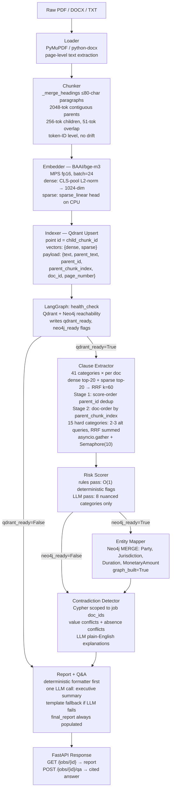
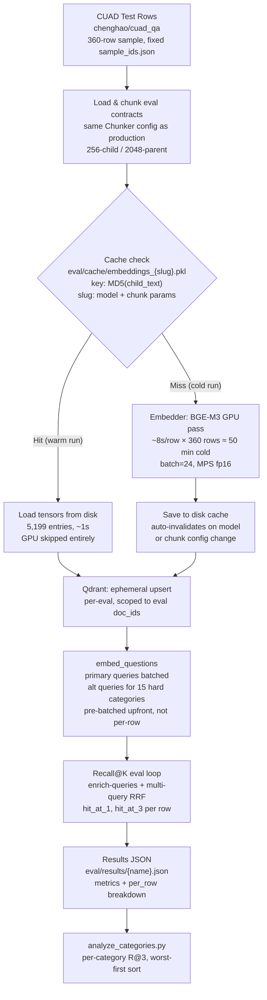

# LexGraph-DD — Master Context

**Last updated:** 2026-04-17
**Status:** Sprint 19 complete. Embedding cache live — 360-row eval cold run populates 5,199 chunk hashes; subsequent runs load from disk in ~1s and skip GPU entirely (~50 min → ~2 min, 30×). R@3 = 61.4% confirmed (360-row, Apr 17). Production pipeline and LangGraph topology unchanged.

---

## What This System Does

Ingests 1–50 PDF/DOCX/TXT contracts → 6 LangGraph agents → structured due diligence brief:
- Clause extraction across 41 CUAD categories
- Risk scoring (rules + LLM reasoning)
- Entity mapping → Neo4j knowledge graph
- **Cross-document contradiction detection via shared Neo4j graph** (key differentiator — no open-source implementation does this)
- Interactive Q&A with page-level citations

---

## Environment

| Item | Value |
|---|---|
| Machine | MacBook Air M4, 16GB RAM |
| Python | 3.12.1 (pyenv) |
| Venv | `/path/to/legal_dd/.venv` |
| Project root | `/path/to/legal_dd/` |
| Package root | `/path/to/legal_dd/legal_due_diligence/` |

```bash
source /path/to/legal_dd/.venv/bin/activate   # every session
/path/to/legal_dd/.venv/bin/python -m uvicorn legal_due_diligence.api.main:app --port 8000
/path/to/legal_dd/.venv/bin/python -m streamlit run legal_due_diligence/ui/app.py
```

`pyrightconfig.json` at root sets `extraPaths: ["legal_due_diligence"]`.

---

## Tech Stack

| Component | Choice | Note |
|---|---|---|
| Orchestration | LangGraph 1.1.6 | State machine, conditional routing |
| Vector store | Qdrant (Docker) | use `query_points()` not `search()` |
| Knowledge graph | Neo4j 5 (Docker) | Bolt :7687, browser :7474 |
| LLM routing | LiteLLM 1.83.4 | Provider portability + fallback chain |
| LLM extraction | groq/llama-3.1-8b-instant → groq/llama-4-scout-17b → ollama/mistral-nemo | Fallback chain |
| LLM reasoning | ollama/mistral-nemo (large batch) / OpenRouter free (≤25 docs) | |
| Embeddings | BAAI/bge-m3 | 1024-dim dense + learned SPLADE sparse; no BM25 pickle |
| ML | PyTorch 2.11.0, MPS active | bge-m3 fp16 on MPS; sparse_linear on CPU |
| PDF/DOCX | pymupdf 1.27.2.2, python-docx 1.2.0 | |
| API | FastAPI 0.128.0 | |
| UI | Streamlit | |

**Infrastructure:**
```bash
docker compose up -d          # start Qdrant + Neo4j
docker compose down -v        # wipe all data (re-index required after)
python run_sprint1.py         # re-index after wipe (no pickle — sparse in Qdrant)
```

---

## Sprint Plan

| Sprint | Goal | Status |
|---|---|---|
| 0–6 | Core pipeline: scaffold → ingestion → all 6 agents → report + Q&A | ✅ DONE |
| 7 | CUAD evals + model search: legal-bert(9%) → bge-base+prefix(15%) | ✅ DONE |
| 8 | bge-m3 hybrid dense+sparse: R@3 15%→42% | ✅ DONE |
| 9 | FastAPI: POST/GET/DELETE /jobs + POST /jobs/{id}/qa | ✅ DONE |
| 10 | Streamlit UI: upload→running→done, Report+Q&A tabs | ✅ DONE |
| 11 | HyDE: disabled — hurts R@3 52.1%→40.8% | ✅ DONE |
| 12 | Async extraction: 50 docs ~10 min → ~3–10s | ✅ DONE |
| 13 | Multi-query for hard categories (CUAD_ALT_QUERIES) | ✅ DONE |
| 14 | e2e eval (e2e_eval.py) + SYSTEM_PROMPT rewrite + extraction hints | ✅ DONE |
| 15 | Parent-child chunking v1: 128-child/512-parent; F1 mean → 0.444 | ✅ DONE |
| 16 | Parent-child v2: 256-child/2048-parent, contiguous parents, parent_id dedup, doc-order delivery | ✅ DONE |
| 17 | Retrieval ceiling: HyDE (−3.9pp), reranker (−9.5pp), MMR (N/A), CUAD def analysis | ✅ DONE |
| 18 | CUAD definition-based query enrichment for bottom-tier categories | ✅ DONE |
| 19 | Embedding cache: materialize chunk embeddings to disk — ~50 min eval → ~2 min repeat runs | ✅ DONE |

---

## Current Benchmark (canonical)

```
Eval: chenghao/cuad_qa, 1244 rows, enrich-queries + multi-query
R@1:  33.3%    R@3:  52.1%   (Sprint 8 baseline — full 1244 rows)
R@3:  61.7%    (360 rows, Sprint 16, enrich + multi-query — best confirmed)
```

**Full progression:**
| Config | R@3 |
|---|---|
| legal-bert baseline | 9% |
| bge-base + prefix | 15% |
| bge-m3, ck=20, enriched | 42% (100-row) → **52.1%** (1244-row) |
| + multi-query + Sprint 16 chunking | **61.7%** (360-row) |
| Sprint 18 query enrichment | **61.7%** (360-row, net neutral — first accurate per-category baseline established) |
| Sprint 19 (cache-warmed run, Apr 17) | **61.4%** (360-row, confirmed — within sampling variance) |

**Rejected improvements (benchmarked):**
- HyDE: −3.9pp (llama-3.1-8b generates boilerplate, shifts embeddings away from contract language)
- Cross-encoder reranker (bge-reranker-v2-m3): −9.5pp (MS-MARCO trained, domain mismatch on legal text)
- MMR: N/A (parent_id dedup already prevents clumping)
- candidate_k=50 vs ck=20: +1pp, within noise — ck=20 confirmed

**Per-category worst (Sprint 18, 360-row, enriched + multi-query — first accurate measurement):**

⚠ All pre-Sprint-18 per-category numbers were from a stale hardcoded file in analyze_categories.py — now fixed.

| Category | R@3 | n |
|---|---|---|
| Most Favored Nation | 0% | 3 |
| Non-Compete | 10% | 10 |
| Revenue/Profit Sharing | 20% | 10 |
| Joint IP Ownership | 29% | 7 |
| Covenant Not To Sue | 40% | 10 |
| IP Ownership Assignment | 40% | 10 |
| Volume Restriction | 40% | 10 |
| Post-Termination Services | 40% | 10 |
| Change of Control | 40% | 10 |
| Non-Disparagement | 43% | 7 |

Sprint 18 query enrichment changes (6 categories): net neutral on overall R@3 (61.7% → 61.7%). Per-category impact cannot be determined without a clean Sprint 17 baseline — that run also used the stale file. This is the new authoritative baseline.

**E2E metrics (200-row, Sprint 15):**
- LLM Found Rate: 78.1% (was 52% before SYSTEM_PROMPT rewrite)
- Token F1 mean: 0.444
- Conditional F1: 0.568

---

## Folder Structure

```
legal_dd/
├── .env                    ← API keys (never commit)
├── docker-compose.yml
├── pyrightconfig.json
├── run_sprint{0,1,3,4,5,6,7,9}.py   ← smoke tests
├── analyze_categories.py   ← per-category R@3 from eval JSON; accepts file arg (fixed Sprint 18 — was hardcoded to wrong file)
├── samples/contract_{a,b}.txt        ← deliberate contradictions for testing
├── eval/
│   ├── cuad_eval.py        ← Recall@K harness (Sprint 19: embedding cache, dead code removed)
│   ├── e2e_eval.py         ← end-to-end extraction eval (Token F1 + found rate)
│   ├── sample_ids.json
│   ├── cache/              ← Sprint 19: chunk embedding cache (pkl, keyed by model+chunk params)
│   │   └── embeddings_bge_m3_p2048_c256_o51.pkl   ← 5,199 entries, ~50 min → ~2 min repeat
│   └── results/
└── legal_due_diligence/
    ├── core/config.py, models.py, state.py
    ├── infrastructure/qdrant_client.py, neo4j_client.py, health_check.py
    ├── ingestion/loader.py, chunker.py, embedder.py, indexer.py
    ├── agents/
    │   ├── orchestrator/graph.py
    │   ├── clause_extractor/retriever.py, prompts.py, agent.py
    │   ├── risk_scorer/rules.py, agent.py
    │   ├── entity_mapper/extractor.py, schema.py, agent.py
    │   ├── contradiction_detector/cypher_queries.py, agent.py
    │   └── report_qa/formatter.py, qa.py, agent.py
    ├── api/main.py, schemas.py, runner.py
    └── ui/app.py
```

---

## Core Data Models (`core/models.py`, `core/state.py`)

```python
DocumentRecord:     doc_id, file_path, processed, page_count

ExtractedClause:    document_id, clause_type, found: bool,
                    clause_text, normalized_value, confidence,
                    source_chunk_id  # UUID → Qdrant → page → PDF

RiskFlag:           document_id, clause_type, risk_level (high/med/low),
                    reason, is_missing_clause, source_clause_id

Contradiction:      clause_type, document_id_a, document_id_b,
                    value_a, value_b, explanation

GraphState:         job_id, status, created_at,
                    documents: list[DocumentRecord],
                    extracted_clauses: list[ExtractedClause],
                    risk_flags: list[RiskFlag],
                    contradictions: list[Contradiction],
                    neo4j_ready, qdrant_ready, graph_built: bool,
                    final_report: str | None,
                    errors: list[str]
```

**Critical:** LangGraph nodes return `dict` (not GraphState). Return only changed fields.

---

## LangGraph Topology

```
START → health_check
  ├─ qdrant_ready=False ──────────────────────────► report_qa → END
  └─ qdrant_ready=True ─► clause_extractor → risk_scorer
                              ├─ neo4j_ready=False ──► contradiction_detector
                              └─ neo4j_ready=True ──► entity_mapper
                                                            └─► contradiction_detector
                                                                      └─► report_qa → END
```

---

## System DFD (Sprint 19 — Production State)

### Production Ingestion + Agent Pipeline



> **Scope note:** No caching occurs in the production path. Every ingestion run embeds fresh via GPU.

---

### Eval Harness DFD (Sprint 19 — with Embedding Cache)

The embedding cache is eval-only — it does not touch the production indexer or any agent code.



> **Speedup:** Cold run (cache miss, 360 rows) ≈ 50 min. Warm run (cache hit) ≈ 2 min total (30×). Question embedding always runs (~22s for 360 questions) — question cache not implemented.

---

## Ingestion Pipeline

**Chunking (Sprint 16 — current):**
- Parents: 2048 tokens, contiguous (no overlap). Each gets UUID `parent_id` + `parent_chunk_index`.
- Children: 256 tokens, 51-token overlap within each parent. Children never cross parent boundaries.
- Embedded: child text only. Parent text stored in Qdrant payload.
- `_merge_headings()`: short paragraphs (≤80 chars) merged forward before chunking.
- Everything at token-ID level — no decode→re-encode drift.

**Embedder:** bge-m3, MPS fp16, CLS-pool L2-norm dense (1024-dim) + sparse_linear head (SPLADE). sparse_linear on CPU (MPS overhead dominates for Linear(1024,1)). Batch=24.

**Qdrant point:** `id=child_chunk_id`, vectors `{"dense": float[1024], "sparse": SparseVector}`, payload `{text, parent_text, parent_id, parent_chunk_index, doc_id, page_number, ...}`

---

## Clause Extractor (Sprint 16)

**Retrieval per (doc × category):**
1. Dense query: Qdrant cosine top-20 (doc_id filter)
2. Sparse query: Qdrant SPLADE top-20 (doc_id filter)
3. RRF fusion k=60 → ranked children
4. **Stage 1 (score order):** dedup by parent_id → top-k unique parents
5. **Stage 2 (doc order):** re-sort by parent_chunk_index ascending
6. LLM receives parent_text (2048 tokens) per unique parent

**Multi-query (`CUAD_ALT_QUERIES`):** 15 hard categories fire 2–3 alt queries, sum RRF scores (consensus boost), same two-stage dedup. Confirmed +6.1pp R@3. Alt query embeddings pre-batched upfront in `embed_questions()` (Sprint 18 fix — was per-row GPU call in eval loop).

**LLM:** groq/llama-3.1-8b → groq/llama-4-scout → ollama/mistral-nemo. temperature=0, max_tokens=300. JSON output → parse → ExtractedClause. Any failure → found=False, confidence=0.0.

**Async:** asyncio.gather per doc, Semaphore(10) global cap. 50 docs: ~3–10s wall time.

---

## Risk Scorer

**Rules pass** (O(1), no LLM): MISSING_CLAUSE_RISK dict (HIGH: Limitation of Liability, Governing Law, etc. MEDIUM: 8 more. LOW: suppressed). PRESENCE_FLAGS: Uncapped Liability found=HIGH, Joint IP/Liquidated Damages/Irrevocable License found=MEDIUM. confidence<0.4 on medium/high categories → MEDIUM flag.

**LLM pass** (8 categories only): Limitation of Liability, Liability Cap, Indemnification, IP Ownership Assignment, Non-Compete, Governing Law, Termination for Convenience, Confidentiality.

---

## Entity Mapper

Reads extracted_clauses → MERGE to Neo4j:
```
(:Document)-[:HAS_CLAUSE]->(:Clause)-[:INVOLVES]->(:Party)
                                                  -[:GOVERNED_BY]->(:Jurisdiction)
                                                  -[:HAS_DURATION]->(:Duration)
                                                  -[:HAS_AMOUNT]->(:MonetaryAmount)
```
Sets `graph_built=True` on state. Fully idempotent (MERGE).

---

## Contradiction Detector

Queries Neo4j (scoped to job's `$doc_ids`):
1. `find_value_conflicts()` — same clause_type, both found, different normalized_value
2. `find_absence_conflicts()` — same clause_type, one found/one missing

LLM explanation per conflict (template fallback on failure). Returns `list[Contradiction]`.

---

## Report + Q&A

**Report:** Deterministic formatter builds risk table + contradiction table (no LLM). One LLM call → JSON `{executive_summary, recommended_actions}`. `_template_narrative()` fallback if LLM fails — `final_report` always populated.

**Q&A** (`POST /jobs/{id}/qa`): hybrid retrieval per doc → merge by RRF → LLM answer + page-level citations. Citations trace back via `source_chunk_id → Qdrant → page_number`.

---

## FastAPI

| Endpoint | Behaviour |
|---|---|
| POST /jobs | Multipart upload, BackgroundTasks pipeline, returns job_id (202) |
| GET /jobs/{id} | Poll: pending/running/done/error; report when done |
| POST /jobs/{id}/qa | Q&A on completed job |
| DELETE /jobs/{id} | Wipes Qdrant points + Neo4j nodes + tempfiles (async cleanup) |

`JOB_STORE`: in-memory dict. BackgroundTasks (not Celery). `python -m uvicorn` via venv Python (not pyenv shim).

---

## LLM Provider Strategy

| Role | Model | Limit |
|---|---|---|
| Extraction primary | groq/llama-3.1-8b-instant | 6000 TPM |
| Extraction fallback 1 | groq/llama-4-scout-17b | separate bucket |
| Extraction fallback 2 | ollama/mistral-nemo | none |
| Reasoning ≤25 docs | openrouter/nvidia/nemotron-3-super-120b-a12b:free | ~200 req/day |
| Reasoning large batch | ollama/mistral-nemo | none |

`config.py` pushes keys to `os.environ` — LiteLLM reads from env directly. OpenRouter models require `:free` suffix. `deepseek-r1:free` NOT available on this account.

---

## Key Architectural Decisions (reference)

- **LangGraph returns dict:** return only changed fields or state field overwrites
- **Health check as node:** routes around infra failures gracefully
- **errors accumulate:** one bad PDF shouldn't abort 49 others
- **Full list replacement:** explicit dedup vs LangGraph blind append
- **parent_id dedup Stage 1:** best child selects which parent; no duplicate parents to LLM
- **doc-order Stage 2:** LLM gets Article 2 before Article 10 (legal cross-references)
- **Cypher scoped to $doc_ids:** graph accumulates across jobs — unscoped returns cross-job contradictions
- **Formatter-first report:** deterministic tables can't be LLM-corrupted
- **temperature=0 everywhere:** deterministic extraction = reliable evals

---

## Sprint 18 — Query Enrichment Changes

Updated in both `eval/cuad_eval.py` (`_CUAD_QUERY_ENRICHMENT`) and `agents/clause_extractor/prompts.py` (`CUAD_CATEGORIES` + `CUAD_ALT_QUERIES`):

| Category | Key additions | Result |
|---|---|---|
| Revenue/Profit Sharing | net receipts, gross revenue, net sales, proceeds | 20% R@3 (authoritative) |
| Non-Compete | restrictive covenant, competing business/products/services | 10% R@3 (authoritative) |
| Joint IP Ownership | co-invented, co-owned, jointly created, both parties | 29% R@3 (authoritative) |
| Change of Control | beneficial ownership, voting securities, controlling interest, majority shares | 40% R@3 (authoritative) |
| Covenant Not To Sue | release claims, discharge, waive right to bring action; not contest/challenge/attack validity | 40% R@3 (authoritative) |
| Most Favored Nation | minimized to: `most favored nation MFN no less favorable price terms any third party`; alt queries: "no less favorable than prices offered to any other customer/third party" | 0% — retrieval ceiling, not a query problem |

⚠ No clean Sprint 17 baseline exists — per-category delta vs pre-Sprint-18 is not measurable. Authoritative numbers above are from the Apr 17 360-row cache run.

**Eval bottleneck (pre-Sprint-19):** chunk embedding = ~8s/row → 360 rows ≈ 50 min.

---

## Sprint 19 — Embedding Cache

Cache location: `eval/cache/embeddings_{slug}.pkl`
Slug encodes: `{model}_{parent_chunk_size}_{child_chunk_size}_{child_overlap}` → auto-invalidates on config change.

Key: `MD5(child_text)` → value: `(dense_vector: list[float], sparse_vector: dict[int, float])`

Flow:
1. `_load_cache()` → load pkl (or empty dict if missing)
2. Diff against all chunks from eval rows → find uncached texts
3. Embed only uncached → update dict → `_save_cache()`
4. All rows reconstructed from cache: `EmbeddedChunk(chunk, vector, sparse_vector)`

Cold run (360 rows, 31,273 unique children): ~50 min → populates 5,199 entries.
Warm run: cache loaded in ~1s, GPU skipped, total eval ~2 min (30× speedup).

**Eval-only** — production ingestion pipeline unchanged. Alt query embeddings (question-side) are NOT cached; they re-embed each run (~22s for 360 questions).

---

## Known Issues

| Issue | Fix |
|---|---|
| `query_points()` rejects `NamedSparseVector` | Use `SparseVector(indices=..., values=...) + using="sparse"` |
| FlagEmbedding ≥1.2 incompatible with transformers 5.x | Implemented bge-m3 directly via AutoModel + hf_hub_download |
| uvicorn pyenv shim misses venv packages | Always use `python -m uvicorn` via venv Python |
| HuggingFace unauth rate limit warning | Set `HF_TOKEN` env var |
| bm25 pickle duplicate on re-run | Gone — sparse vectors in Qdrant, no pickle |
| Groq 6000 TPM per model | Fallback chain eliminates wait |

---

## Common Commands

```bash
# Start everything
docker compose up -d
source /path/to/legal_dd/.venv/bin/activate

# Smoke tests
python run_sprint1.py     # ingestion + retrieval
python run_sprint9.py     # full API lifecycle

# Eval
python eval/cuad_eval.py --n 400 --enrich-queries --multi-query
python eval/e2e_eval.py --n 200 --enrich-queries --multi-query
python analyze_categories.py eval/results/FILENAME.json

# Full reset
docker compose down -v && docker compose up -d && python run_sprint1.py
```

---

## Sample Contracts (deliberate contradictions)

| Clause | contract_a.txt | contract_b.txt |
|---|---|---|
| Governing Law | Delaware | New York |
| Liability Cap | 12 months fees | 6 months fees |
| Payment Terms | 30 days | 45 days |
| Confidentiality | 5 years | 3 years |
| Termination | 30 days notice | **missing** |
